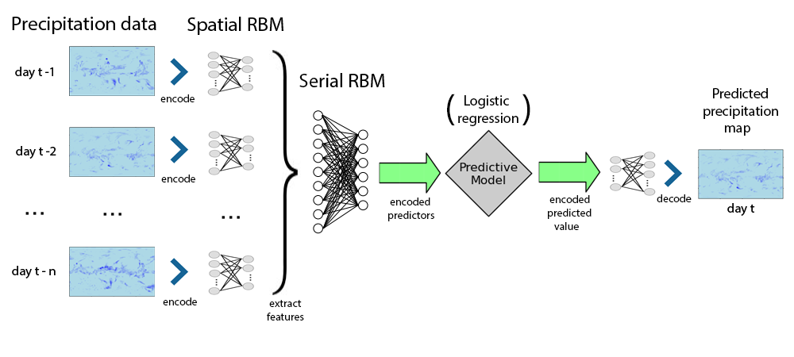
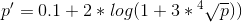
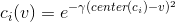
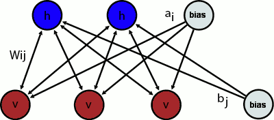

<font size = 12> Abstract </font><br>

The following material describes briefly how does the ARDBN (autoregressive Deep Belief Network) work, 
applied to short term precipitation rate prediction problem. The current model is yet a minimalistic prototype and will be improved in numerous aspects, thus one should not consider current capabilities and quality rates as final ones.

<font size = 12> Introduction </font><br>

The problem of precipitation rate evaluation and prediction is known to be one of the core applications of atmospheric sciences. There are numerous geophysical, statistical and engineering approaches[1] that are used to make estimations of the real precipitation rates and predictions for the future.

This entire text wall aims to dig into possible alternative methods on solving just one of the challenges enumerated: the short term precipitation rate estimation. The presented approach suggests an application of several deep learning tools in a little unusual manner. 

It should be noted though, that this approach is not suggested as a ready-made tool to be used instead or with the geophysical methods, but rather a promising prototype.

The data this model is trained and validated on consists of time series of daily measured Earth precipitation rates at surface for a grid of 192x94 dimensions. The data is given for 6 years in a sequence.


```{r randomDays,echo = FALSE}
source("Rsource/preproc.R")
library(lattice)
options(warn=-1)
prate.plotMap.fromDay.lattice(prate.original[1,,],"Day 1")
#prate.plotMap.fromDay.lattice(prate.original[250,,],"Day 200")
#prate.plotMap.fromDay.lattice(prate.original[350,,],"Day 350")
```

The core idea of this model lies in pretty straightforward exploitation of spatial restricted Boltzmann machines[2] to represent typical states of small tiles of differential precipitation map (daily precipitation rate changes).

A simple autoregressive model is than used to predict the next map state from yet another RBM representation of time series sequences over the preceding RBM images of the map, mixed with a few auxiliary heuristics of a various sort.


This is a scheme of a current model prototype. Its sole purpose is to give a brief overview of an architecture used, thus some implementation details were omitted.

<font size = 12>Data transformation</font><br>
First of all, it should be noted, that the initial precipitation rate data has a seemingly exponential distribution.

```{r distr_original,echo = FALSE}
vv = as.vector(prate.original)
qplot(vv,main = "Global precipitation rate histogram",xlab = "Precipitation rate")
```

The first transformation to be applied is a simple and stupid heuristic that emphasizes the difference between zero and nonzero precipitation rates, and at the same time establishes a more even distribution of different precipitation rates. This transformation has no theoretical value, yet it has proven to be more compatible with predictive model, than the original precipitation rate.



```{r distr_transformed,echo =FALSE}
vv = as.vector(prate.transformed)
qplot(vv,main = "Global transformed precipitation rate histogram",xlab = "Transformed precipitation rate")
```


The vanilla (Bernoulli) RBMs are known to work well on input layer data with close to Bernoulli distribution. The precipitation data, however, is the distribution of real values far from ideal Bernoulli-RBM input.

There are two known approaches to solve this problem: one lies in modifying RBM energy function to work with Gaussian input layer values[3], and the other one - in using one of NN-specific encoders.

As a first working hypothesis, it was decided to use simple distance-based encoder[4]. The encoder transforms every real precipitation data value into a vector of a fixed length, with its elements approximately Bernoulli-distributed.

The encoding principle can be briefly defined thus: every code vector element corresponds to a value within precipitation rate diapason. The value of each element is defined as exponent of an inverse squared distance between the code element center and the encoded value.



Where c<sub>i</sub> is a number in a code, v is the encoded value and center(c<sub>i</sub>) is the value for which c<sub>i</sub> = 1 .

For the prototyping purpose, the differential transformed precipitation rate is encoded by an encoder with 15 code values, evenly distributed within (-0.75;0.75) diapason. This encoder has a certain encoding loss, yet the loss of encoding is incomparable with the ones on higher levels.

One of the key positive aspects of such encoders is that they encode close real values into overlapping code vectors, which is exactly what is necessary for further RBM manipulations.

However, it should be noted, that the encoding approach might turn out suboptimal. A certain drawback is that
the encoded data has vastly higher dimensionality and, while it does not affect model complexity (base RBMs above function as dimensionality shrinkers), the memory usage of the model's low levels is vastly higher than it would be with the Gaussian RBM approach.

<br><br>
<font size = 12> Basic Spatial RBM </font><br>



The first layers of RBMs are trained directly on encoded precipitation data. Due to the nature of encoded values, these rbms are using standard energy function for Bernoulli-like input layer distribution.

<br>
Where v<sub>i</sub> is a state of a corresponding visible unit; h<sub>i</sub> is a state of a corresponding hidden unit; W<sub>ij</sub> is a weight between neurons i and j; a<sub>i</sub> is a bias of a visible unit and b<sub>j</sub> is a bias of a hidden unit.

To better exploit the spatial nature of precipitation maps and to simplify learning routine, instead of one main RBM, numerous small size rbms are trained independently on overlapping rectangular chunks of image, forming yet another grid of rbm representations. This basic grid is than used as both input for higher level serial RBM layers and as a label for predictive models.

Here are several encoded/decoded differential precipitation rate examples for 16 longitude 8 latitude unit tiles:

```{r enc_smp, echo = FALSE}
pratemap = prate.transformed
pratemap.matr = matrix(pratemap,nrow = prate.dims[1], ncol = prate.dims[2]*prate.dims[3])
pratemap.diff = diff(pratemap.matr)
dim(pratemap.diff) = dim(pratemap) - c(1,0,0)
rm(pratemap.matr)

load("pres/updown200.Rdata"); rbmdown200 = rbmdown
load("pres/updown25.Rdata"); rbmdown25 = rbmdown

prate.plotMap.fromDay.lattice(pratemap.diff[10,,],"Differential map days 10-11: original")
prate.plotMap.fromDay.lattice(rbmdown25[10,,],"Differential map days 10-11: 25 hidden units per tile")
prate.plotMap.fromDay.lattice(rbmdown200[10,,],"Differential map days 10-11: 200 hidden units per tile")
```

In order to evaluate the quality of the spatial RBM layer, a RMSE (root mean squares error) metric was computed between the precipitation maps that did not participate in RBM training (crossvalidaion) and their RBM representations (downward RBM projection from the upward RBM projection of the original map). Some of the measured results can be viewed on the next plot:

```{r enc_cv, echo = FALSE}
qplot(x = c(10,25,50,60,100),
      y = c(0.06018254, 0.02042611,0.01036832, 0.009761155, 0.007804673),
      geom = "line",
      main = "Transformed encoding RMSE for spatial RBM layer",
      xlab="Amount of hidden units",
      ylab="encoder RMSE")
```

Note that the error is computed for the precipitation data after the initial heuristical transformation. All the models in this list were trained on precipitation map fractions of 16x12 longitude and latitude units. The horizontal offset between adjacent RBM tiles was 8 longitude units and the vertical - 6 latitude units. The optimization parameters were individually optimized for each case. The main model prototype was trained with 100 hidden units per RBM tile.

<br><br>
<font size = 15> Serial Spatial RBM </font><br>
The next RBM layers are fed with short time series of precipitation maps, processed by basic spatial RBM layer below. Thus, de facto, serial RBM layer is trained to extract frequent short sequences of precipitation rate dynamics that are than used to predict the upcoming precipitation rates.

One more notable thing is that the RBMs on the serial levels are typically incorporating a small neighborhood of lower level  RBM tiles, encoding data on a larger scale.

The serial RBMs were not optimized for their encoding properties, but rather the crossvalidated efficiency(in terms of RMSE) of the predictive models, trained on their top.

<br><br>
<font size = 12> Predictive model </font><br>
At this iteration, the model used to predict precipitation rates is an array of logistic regressions, that use predictors from the top serial RBM layer output. The prediction labels for these models are the basic spatial RBM codes. This strategy has empirically proven itself superior to raw precipitation data prediction with the appropriate regression models.

The final prediction is made by projecting the predicted RBM hidden layer back to precipitation mapping. As the RBM input areas are overlapping with each other, the overlapped predictions are averaged up, thus creating an in-built model bagging.

To provide an alternative solution, one more model is trained directly from series of spatial RBMs, not using the serial layer at all and in fact partially assuming it's functions. There are also two "reference" models: the one that always predicts the next day equal to previous one, and a vanilla third-order ARIMA model without any RBM transformations.

```{r pred_cv,echo = FALSE}
library(reshape2)
numHidden = c(50,100,200,300,500)
rmse.serial = c(0.0242725,0.0170811,0.0135548,0.01137628,0.0099714)
rmse.noChange = rep(0.02736182,5)
rmse.arima = rep(0.01950351,5)
rmse.noSerial = rep(0.01318302,5)

qplot(main = "Prediction RMSE for one day predictions")+
  geom_line(aes(x=numHidden,y=rmse.serial,color="Serial"))+
  geom_line(aes(x=numHidden,y=rmse.noSerial,color = "WithoutSerial"))+ 
  geom_line(aes(x=numHidden,y=rmse.noChange,color="By preceding day"))+ 
  geom_line(aes(x=numHidden,y=rmse.arima,color="ARIMA"))+
  xlab("Amount of hidden units")+
  ylab("Prediction RMSE (CV)")+
  labs(color="Models")
```

All estimates are taken with a one-year-out crossvalidation, but for the accuracy of the serial model with 500 hidden serial units, that was only estimated once on a randomly chosen training/validation split.
As it can be observed, the d

<br><br>
<font size = 12> Future prospects </font><br>
It has to be noted, that simple logistic regression was used as a prediction model just to provide some usability for the prototyping phase. The other good candidates for predictive models are Support Vector Machines(SVM), boosted Regression Trees, boosted Logistic Regression models or SVMs. De facto, this part of the model is so far least optimized.

To regularize the logistic regression models, a simple L2 regularization was used with the parameter optimized individually for a given RBM layer configuration.

It is also likely, that some efficiency increase can be gained by including additional elements into model architecture.

The yet unchecked ideas are:
- Incorporating different sorts of data: 
  - temperature, 
  - atmospheric pressure, 
  - normal precipitation maps (right now it uses only differential maps), 
  - seasonal changes,
  - etc.
- Optimizing the amount of layers in the network.
- Optimizing for order and range of serial RBM tiles.
- Predicting multiple spatial RBM layers at once and averaging results.
- Adding autoregression-specific regularization like penalizing frequent high-level serial RBM image changes.
- Trying Gaussian RBMs instead of encoders.


<font size = 12> Predicting multiple days ahead </font><br>
There are two possible means to predict precipitation rates more than one day ahead. 
The explicit option is to teach the model with the correct label data. 

However, it might occur so, that the stepwise prediction for one day at once will turn out to be a more reliable method with proper regularizations.
So far, this question is not yet studied thoroughfully enough to make any conclusions.


<font size = 12> Some deep and thorough conclusions </font><br>

The few results already achieved within this research and the rate at which they have been improving so far instills hope that the further iterations of deep learning precipitation rate prediction will be used as at least one of the ensemble of models that we blame each time we were caught by the rain outdoors without an umbrella after hearing the erroneous forecast.

Thanks for listening!

<br><br>
<font size = 12> Credits </font><br>
[1] https://www.elsevier.com/books/statistical-methods-in-the-atmospheric-sciences/wilks/978-0-12-385022-5

[2] http://www.utstat.toronto.edu/~rsalakhu/papers/dbm.pdf

[3] https://www.elen.ucl.ac.be/Proceedings/esann/esannpdf/es2012-95.pdf

[4] http://numenta.org/resources/HTM_CorticalLearningAlgorithms.pdf

R packages used so far: caret, deepnet, doSNOW, foreach, ncdf, lattice

