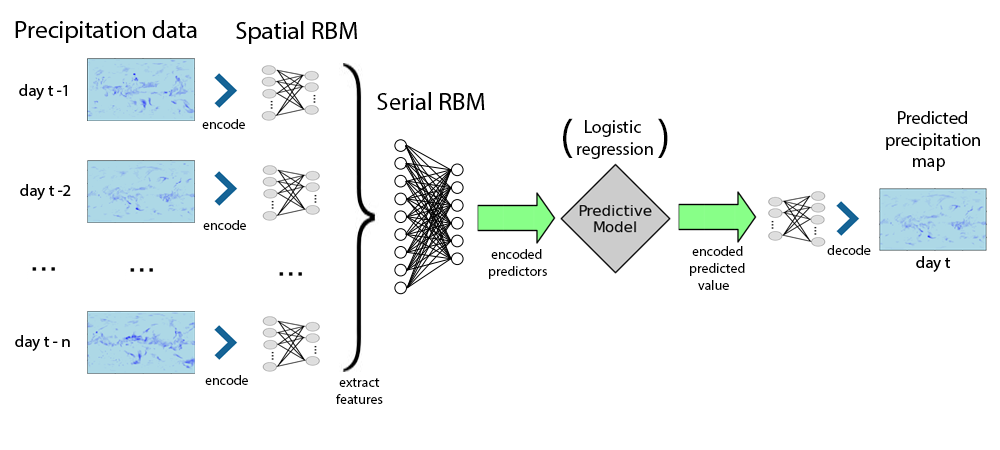

<font size = 12> О чём здесь рассказывается </font><br>

Весь следующий текст описывает успехи и неудачи небольшого собранного прототипа системы краткосрочного прогноза полей осадков (алгоритм обучения прилагается, более-менее неплохие обученные версии весят 1.6-3.6GB и могут приехать на флешке, если понадобятся).

<font size = 12> О проблеме </font><br>

Проблема прогноза полей осадков стоит в атмосферных науках уже достаточно давно и знает множество постановок и подходов к решению[1] из сферы геофизики, синоптики и статистики. Дабы не пытаться объять необъятное, возьмём исключительно частную задачу в её рамках, а именно построения краткосрочного прогноза поля осадков.

Итак, известны измеренные значения уровня осадков на некоторой местности за несколько идущих подряд дней i-n, i-n+1, ... , i-1, i. Необходимо построить модель, которая по этим данным может предсказать уровень осадков на этой же местности для дня i+1, либо в общем случаt, i+d.

Эталонные значения уровня осадков измеряются либо метеостанциями, либо на основании радарных данных, и в любом случае проходят несколько стадий коррекции, подробное изложение которых не вошло бы в и в отдельный отчёт. 

Для простоты на этапе прототипирования будем пологать, что данные достаточно точны, чтобы использование их без предобработки было возможно.

Предоставленные для баловства данные содержат информацию о суточном значении уровня осадков (кг/м^2/c) по поверхности Земли в точках пересечения  94 фиксированных значений долготы и 192 значений широты. Данные даны за каждый день в течение нескольких лет.

```{r randomDays,echo = FALSE}
source("Rsource/preproc.R")
library(lattice)
options(warn=-1)
prate.plotMap.fromDay.lattice(prate.original[1,,],"Day 1")
#prate.plotMap.fromDay.lattice(prate.original[250,,],"Day 200")
#prate.plotMap.fromDay.lattice(prate.original[350,,],"Day 350")
```


Центральная идея модели заключается в том, чтобы представить фрагменты поля осадков в виде разреженного вектора на выходе локальных ограниченных Машин Больцмана (SRBM)[2]. Далее при помощи тех же машин Больцмана создаётся представление последовательности карт осадков (в уже закодированном виде) в вектор типичных цепочек подряд идущих карт.

Наконец, обучается простая регрессионная модель, у которой известные данные - закодированные последовательноти из предыдущего параметра, а целевые значения - RBM-представление карты осадков для целевого дня. На данном этапе модель - логистическая регрессия, в перспективе стоит попробовать что-то более вдумчивое.



Схема побоища для простоты понимания, что от чего и чему учится.

<font size = 12>Преобразования данных</font><br>
Прежде всего, стоит отметить, что исходные данные об уровне осадков в среднем (для всех точек за все дни) имеют следующую гистограмму распределений.

```{r distr_original,echo = FALSE}
vv = as.vector(prate.original)
qplot(vv,main = "Global precipitation rate histogram",xlab = "Precipitation rate")
```

Из исключительно эвристических соображений левой пятки, модель было решено обучать на несколько преобразованных данных. Если быть более точным, использовалась импровизация на тему "логарифмические преобразования"


Из полезных свойств - более "плоское" распределение значений, также отделение нулевых от ненулевых показателей уровня осадков и большая совместимость с представлением чисел в ЭВМ.


```{r distr_transformed,echo =FALSE}
vv = as.vector(prate.transformed)
qplot(vv,main = "Global transformed precipitation rate histogram",xlab = "Transformed precipitation rate")
```


Машины Больцмана в их естественном виде (Bernoulli RBM) лучше всего себя чувствуют, когда на входе у них данные распределены похоже на распределение Бернулли. Сказать это про что либо из показанного ранее про поля осадков нельзя даже с натяжкой, поэтому целесобразно было сделать одно из двух возможных изменений: "Гауссова" функция энергии[3] в RBM или использование энкодеров.

В качестве первой рабочей гипотезы, был использован простой энкодер расстояния[4]. При кодировании, действительное число отображается в вектор элементов, распределённых приближённо по Бернулли.

Суть кодирования в том, что каждому элементу вектора кода сопоставляется эталонное значение в диапазоне возможных значений кодируемой величины. Значение этого элемента определяется какой-нибудь убывающей функцией от расстояния между кодируемым значением и эталоном. На данном этапе используется экспонента от обратного квадратичного расстояния:


Где c<sub>i</sub> это элемент кода, v - кодируемая величина, а c<sub>i</sub> - эталонное значение для данного элемента кода.

На практике, начиная с определённого расстояния эта функция не вычисляется, а считается равной нулю, что недалеко от истины и экономит время вычисления.

При декодировании значение восстанавливается как среднее взвешенное эталонов энкодера, где веса - значение элементов кода. Имеется определённая ошибка декодирования, но она не кажется особенно огромной и её анализом на данном этапе было решено пренебречь.

На данном этапе, вычеты по преобразованное карте осадков кодируются энкодером с 15 эталонами, распределёнными равномерно в диапазоне (-0.75;0.75).

Ключевым преимуществом таких энкодеров можно считать то, что близкие по значению величины будут иметь похожие, но различимые коды, что полезно с точки зрения модели.

Главный же недостаток энкодеров - они существенно повышают размерость данных. В данном случая это влияет только на самый первый слой RBM, для которого они используются, но эффект всё равно заметно бьёт по "весу" обученной модели в памяти.

<br><br>
<font size = 12> Базовый RBM в модели </font><br>


Как уже было сказано, первые слои RBM обучаются непосредственно на закодированных преобразованных данных об уровне осадков. Обучение сводится к минимизации функции энергии:

<br>
Где v<sub>i</sub> - состояние элемента входного слоя; h<sub>i</sub> состояние элемента выходного слоя; W<sub>ij</sub> - вес; a<sub>i</sub> - смещение элемента входного слоя b<sub>j</sub> - смещение элемента выходного слоя.

Дабы использовать природу полей осадков и обойти имеющиеся аппаратные ограничения (6 ядер, 6GB оперативной памяти), вместо единоразового обучения всего слоя, выполняется независимое обучение множества локальных RBM, на вход каждой из которых подаётся только небольшая прямоугольная область карты осадков, частично пересекающаяся с такими областями соседних RBM.

Для примера приведены карты осадков, закодированные обученными локальными RBM с 25 и 200 элементами скрытого (выходного) слоя. Во всех случаях единичные RBM обучались на прямоугольниках 16x12 значений с интервалами в 8 и 6 значений между соседними RBM по вертикали и горизонтали соответственно.


```{r enc_smp, echo = FALSE}
pratemap = prate.transformed
pratemap.matr = matrix(pratemap,nrow = prate.dims[1], ncol = prate.dims[2]*prate.dims[3])
pratemap.diff = diff(pratemap.matr)
dim(pratemap.diff) = dim(pratemap) - c(1,0,0)
rm(pratemap.matr)

load("pres/updown200.Rdata"); rbmdown200 = rbmdown
load("pres/updown25.Rdata"); rbmdown25 = rbmdown

prate.plotMap.fromDay.lattice(pratemap.diff[10,,],"Differential map days 10-11: original")
prate.plotMap.fromDay.lattice(rbmdown25[10,,],"Differential map days 10-11: 25 hidden units per tile")
prate.plotMap.fromDay.lattice(rbmdown200[10,,],"Differential map days 10-11: 200 hidden units per tile")
```

Оценка качества базовых локальных RBM производилась методом простой валидации: случайно выбиралось подмножество дней, на которых производится обучение. Все остальные примеры использовались для оценки качества (тестовая выборка). Каждый тестовый пример сначала кодировался, потом декодировался, при этом вычислялась поточечная среднеквадратическая ошибка декодированного изображения с оригиналом. Ниже приведены такие значения в среднем для нескольких моделей той же размерности с разным количеством скрытых слоёв. Размер тестовой выборки - 0.3 от всех дней, выбранные случайным образом.


```{r enc_cv, echo = FALSE}
qplot(x = c(10,25,50,60,100),
      y = c(0.06018254, 0.02042611,0.01036832, 0.009761155, 0.007804673),
      geom = "line",
      main = "Transformed encoding RMSE for spatial RBM layer",
      xlab="Amount of hidden units",
      ylab="encoder RMSE")
```

Стоит также лтметить, что ошибки измерены на уже преобразованных данных. Все модели использовали размер блока в 16x12 дискрет с отступами 8x6 по долготе и широте соответственно. Коэффициент обучения и скорость его уменьшения оптимизмровались индивидуально для каждого случая. В дальнейшем модель использует 100 скрытых значений на блок.

<br><br>
<font size = 15> Представление последовательностей в RBM </font><br>

Почледующие слои сети обучаются не на отдельных временных срезах, а на цепочках идущих подряд закодированных вычетов полей осадков. На данном этапе используются цепочки длины 3.
Фактически, эти слои кодируют обобщенные сценарии динамики полей осадков.

Также блоки на более высоких уровнях обучаются сразу от нескольких подблоков уровнем ниже, таким образом кодируя закономерности большего масштаба.

Поскольку "цепочечные" RBM  не используются как декодер, их качество оценивалось косвенно через качество использующих их регрессионных моделей прогноза.

<br><br>
<font size = 12> Модель прогноза </font><br>

В качестве модели прогноза "на первое время" в модели используется простая логистическая регрессия от "цепочечных" RBM на все элемееты самого первого уровня RBM-кодированного целевого дня. Такой массив логистических линейных моделей обучается в лоб методом минимизации логистической функции потерь с l2 регуляризацией (коэффициент оптимизируется индивидуально).

Данная стратегия эмпирически показала себя лучше предсказания непосредственно уровня осадков.

Итоговый прогноз вычисляется декодированием предсказанного RBM-представления обратно во фрагменты карты осадков. Значения в пересечениях соседних блоков усредняются, фактически создавая эффект bagging.

Для сравнения, были обучены несколько моделей с различным количеством скрытых элементов в самом верхнем слое. Также была обучена простая авторегрессия от первого уровня RBM эквивалентного порядка (3). В рамках максимизации эмпирической самооценки авторов была также обучена простая ARIMA авторегрессия уровня осадков по окрестности 16x12 блоков для вычетов полей осадков первого порядка, показавшая оптимум качества при прогнозе по 5 предыдущим дням. Наконец, отдельная модель всегда прогнозирует следующий день равным предыдущему.


```{r pred_cv,echo = FALSE}
library(reshape2)
numHidden = c(50,100,200,300,500)
rmse.serial = c(0.0242725,0.0170811,0.0135548,0.01137628,0.0099714)
rmse.noChange = rep(0.02736182,5)
rmse.arima = rep(0.01950351,5)
rmse.noSerial = rep(0.01318302,5)

qplot(main = "Prediction RMSE for one day predictions")+
  geom_line(aes(x=numHidden,y=rmse.serial,color="Serial"))+
  geom_line(aes(x=numHidden,y=rmse.noSerial,color = "WithoutSerial"))+ 
  geom_line(aes(x=numHidden,y=rmse.noChange,color="By preceding day"))+ 
  geom_line(aes(x=numHidden,y=rmse.arima,color="ARIMA"))+
  xlab("Amount of hidden units")+
  ylab("Prediction RMSE (CV)")+
  labs(color="Models")
```

Метод оценки качества во всех случаях кроме одного - кроссвалидация выкидыванием одного года из обучающей выборке по очереди за все года. Стоит отметить, что на каждом шаге валидации модель переобучалась с нуля целиком, а не только ее прогнозирующая часть. Исключение - модель с 500 скрытыми слоями училась 1 раз на всех годах кроме 1998го, на котором она проверялась. Причина проста: обучение ее на прострм ПК занимала больно много времени.

<br><br>
<font size = 12> О гигатоннах ещё не сделанного </font><br>

Значительное количество (читать "все") используемых в модели методов были выбраны методом первой непровальной попытки среди того, что удобно попробовать. Разумеется, здравый смысл требует проверить возможные их альтернативы и хоть как-то обосновать выбор финальной модели. Наиболее важные из альтернативных методов: 

 - Как известно, задачи на картах осадков обычно рассматривают как задачи мультисенсорные и не зазря. Вероятно, определённого эффекта можно достичь дополнительными источниками входных данных. Как потенциальные кандидатуры можно рассматривать данные по температуре, давлении и пр.
 
 - Использование более приспособленной к задаче модели предсказания. Из кандидатов виднеется LogitBoost и  Support Vector Machines(SVM), из более вульгарных методов - Gradient Boosted Regression Trees и Convolution Networks. Вообще модель прогноза пока сильнее прочих обделена вниманием.
 
 - Обучение логистических моделей прогноза производилось независимо с простой L2-регуляризацией. Вероятно, имеет смысл попробовать L1 (Lasso) и аддитивный штраф за энтропию (по К. Шеннону) скрытых слоёв внутри одного дня (поправка на разреженность).
 
 - Требуется проверить ряд эвристик, таких как добавление информации о сезоне, закодированной для лучшей интерпретации моделью по аналогии с энкодерами уровня осадков.
 
 - Архитектура модели и количество слоёв до сих пор не оптимизированы.
 
 - В качестве замены Машин Больцмана можно рассматривать PCA, Regularized SVD и прочие разложения. Также в самих RBM возможно использование гауссовой функции энергии вместо энкодеров. 
 
 - Возможен одновременный прогноз для нескольких слоёв RBM и регуляризация модели по рассогласованию между этими уровнями.


<font size = 12> <вольные мысли> О предсказании на несколько дней вперёд </font><br>

Прогноз поля осадков более, чем на один день вперёд, возможен либо в явном виде, обучением модели прогноза на нужный срок, либо итеративными прогнозами на день вперёд и использованием предсказанных данных в качестве входных для следующих итераций.

О каких-то существенных выводах может идти речь не раньше, чем когда дойдут руки сделать полномасштабные испытания и сравнить ошибки обоих методов кроссвалидацией.

<font size = 12> Какие-то глубоко идущие заключения </font><br>

Те немногие результаты, которых удалось достичь, а также темпы улучшения этих результатов внушает  оптимизм и надежду на то, что после ещё десятков беспощадных итераций методы глубокого обучения будут применимы и полезны в составе ансамблей из множества разнотипных предсказывающих моделей.

Благодарю за внимание.

<br><br>
<font size = 12> Credits </font><br>
[1] 

[2] http://www.utstat.toronto.edu/~rsalakhu/papers/dbm.pdf

[3] https://www.elen.ucl.ac.be/Proceedings/esann/esannpdf/es2012-95.pdf

[4] http://numenta.org/resources/HTM_CorticalLearningAlgorithms.pdf

R packages used so far: caret, deepnet, doSNOW, foreach, ncdf, lattice

